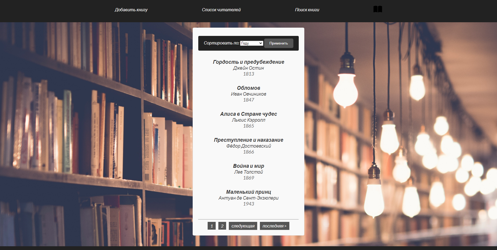
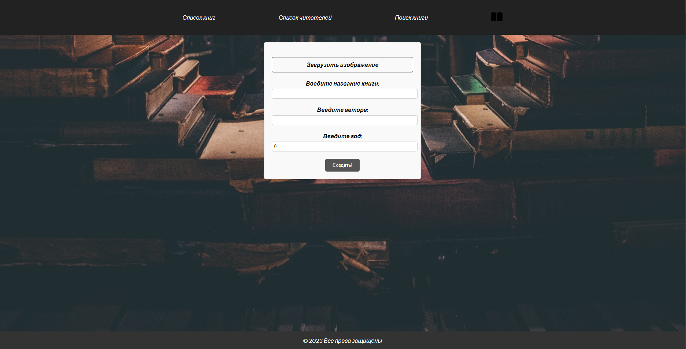
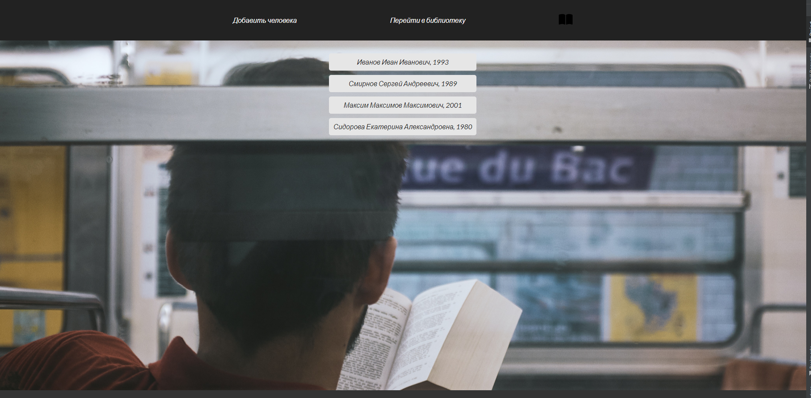

# Библиотека (Library) на Spring Boot

Это проект веб-приложения библиотеки, созданный с использованием Spring Boot. Это веб-приложение предоставляет базовую функциональность управления книгами и пользователями в библиотеке.



## Особенности

- Добавление, редактирование и удаление книг.
- Регистрация и аутентификация пользователей.
- Управление пользователями и ролями.
- Поиск книг по различным критериям.
- Пользовательский интерфейс стилизован с использованием CSS.

## Технологии

- **Spring Boot**: Основа для создания веб-приложения.
- **Spring Security**: Для обеспечения безопасности и аутентификации.
- **Thymeleaf**: Для создания шаблонов веб-страниц.
- **Hibernate/JPA**: Для работы с базой данных.
- **Maven**: Для управления зависимостями и сборки проекта.
- **PostgreSQL**: Внешняя база данных.

## Установка и запуск

1. Клонируйте репозиторий на свой локальный компьютер.
2. Используйте Maven для сборки проекта.
3. Настройте подключение к вашей базе данных PostgreSQL в файле `application.properties`.
4. Запустите приложение с помощью Spring Boot.
5. Перейдите по адресу `http://localhost:8080/books` в веб-браузере.

```bash
git clone https://github.com/VldadimirR/LibrarySpringBoot.git
cd LibrarySpringBoot
mvn spring-boot:run
```
## Скриншоты






### Создание таблицы для пользователей
```sql
CREATE TABLE IF NOT EXISTS people (
    id SERIAL PRIMARY KEY,
    fio VARCHAR(255) NOT NULL,
    age INTEGER,
    login VARCHAR(255) NOT NULL,
    password VARCHAR(255) NOT NULL,
    role VARCHAR(255) NOT NULL
);
```

### Создание таблицы для книг
```sql
CREATE TABLE IF NOT EXISTS book  (
    id SERIAL PRIMARY KEY,
    name VARCHAR(255) NOT NULL,
    author VARCHAR(255) NOT NULL,
    year INTEGER,
    person_id INTEGER REFERENCES people(id),
    taken_at DATE,
    image_path VARCHAR(255),
);